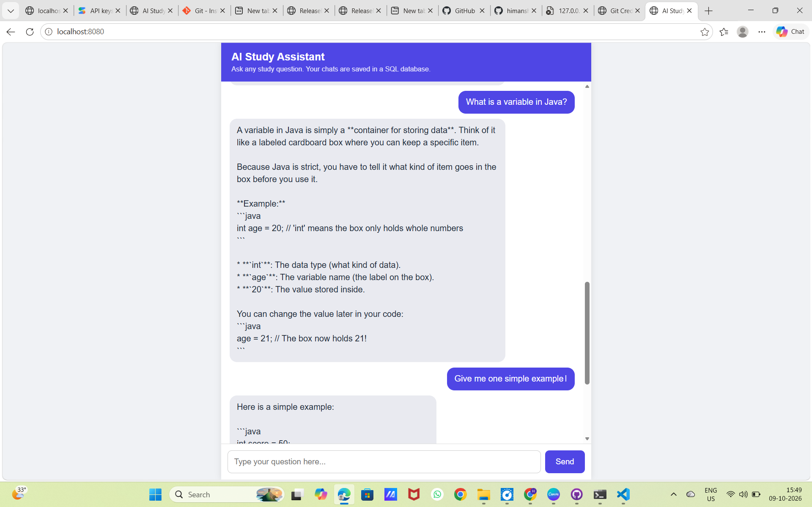

# AI Study Assistant Chatbot

A full-stack AI chatbot web app that answers study questions and saves every conversation in a SQL database.



## Features
- Chat page where you ask study questions and get simple AI explanations
- Conversation history saved in SQLite and reloaded when you refresh the page
- The AI remembers the last 10 messages, so follow-up questions work
- Automatic retry when the AI service is busy

## Tech Stack
- **Backend:** Java 17+ (built-in HTTP server, java.net.http client)
- **Database:** SQLite (via JDBC)
- **Frontend:** HTML, CSS, JavaScript
- **AI:** Google Gemini API
- **Libraries:** Gson, sqlite-jdbc, slf4j-api

## How It Works
Browser (HTML/JS) → Java server → Gemini API → reply is saved in SQLite → reply is shown in the browser.

## Project Structure
```
backend/    Java server (Server.java)
frontend/   Chat page (index.html)
database/   SQLite file is created here at first run
lib/        Jar libraries (download steps below)
```

## How to Run (Windows PowerShell)
1. Install JDK 17 or newer.
2. Get a Gemini API key from https://aistudio.google.com/apikey
3. Download the libraries into `lib/`:
```
cd lib
curl.exe -L -o gson-2.10.1.jar https://repo1.maven.org/maven2/com/google/code/gson/gson/2.10.1/gson-2.10.1.jar
curl.exe -L -o sqlite-jdbc-3.45.1.0.jar https://repo1.maven.org/maven2/org/xerial/sqlite-jdbc/3.45.1.0/sqlite-jdbc-3.45.1.0.jar
curl.exe -L -o slf4j-api-1.7.36.jar https://repo1.maven.org/maven2/org/slf4j/slf4j-api/1.7.36/slf4j-api-1.7.36.jar
cd ..
```
4. Set your API key (never commit it):
```
$env:AI_API_KEY = "your_key_here"
```
5. Compile and run:
```
cd backend
javac -cp "../lib/*" Server.java
java -cp ".;../lib/*" Server
```
6. Open http://localhost:8080 in your browser.

## Notes
- The model name is set in `Server.java` (`MODEL`). Change it if your key supports a different model.
- The API key is read from the `AI_API_KEY` environment variable and is not stored in the code.